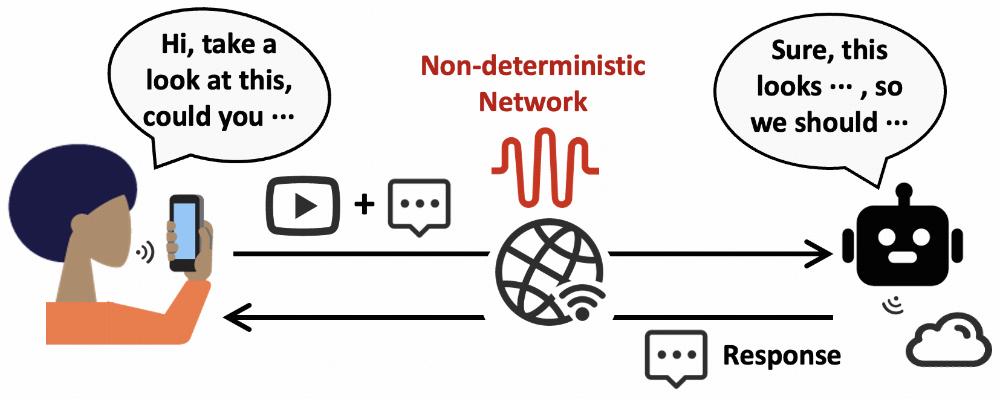
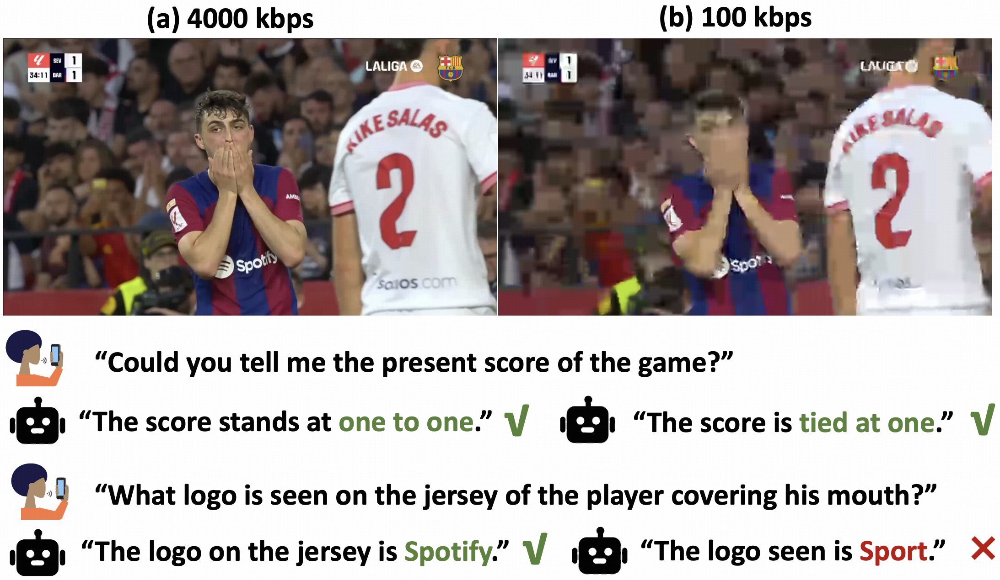
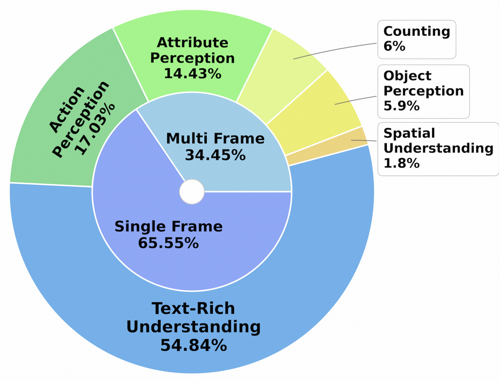
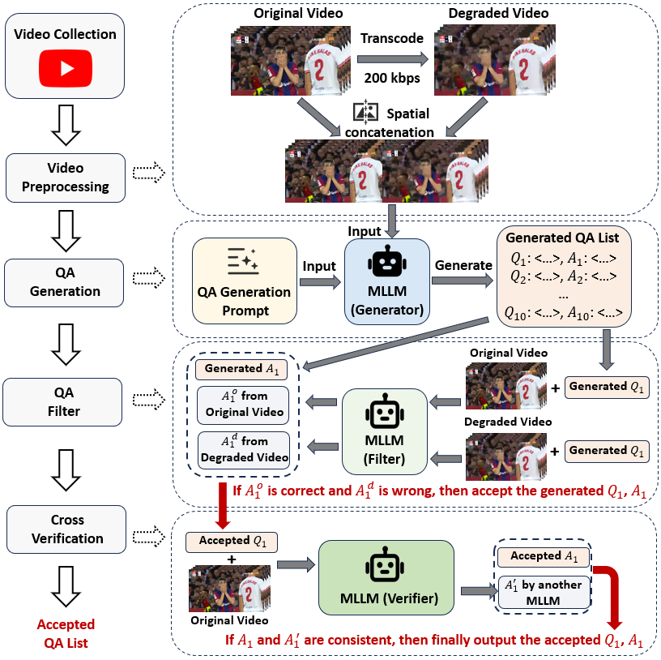

# DeViBench: The first benchmark evaluates how video quality affects MLLM accuracy.

This repository maintains the **DeViBench** (**De**graded **Vi**deo Understanding **Bench**mark) from the HotNets paper **"Chat with AI: The Surprising Turn of Real-time Video Communication from Human to AI"**.

*The benchmark is continuously growing, and we are considering transforming all existing Streaming Video Understanding Benchmarks to the "DeViBench style".




## 📁 Dataset Content

The dataset file `datasets.csv` contains the following columns:

| Column | Description |
|--------|-------------|
| `sample_folder` | Corresponding video ID. This dataset uses the same video files as the [StreamingBench Real-Time Visual Understanding](https://huggingface.co/datasets/mjuicem/StreamingBench/tree/main) dataset, available for download from the provided link. |
| `start_time` | Start time of the video segment. Questions refer to a 5-second segment starting from this timestamp. |
| `question` | The question content. |
| `options` | Available options for the question. |
| `standard_answer` | Standard answer to the question. |
| `task_type` | Task type of the question. |

## 📥 Data Download

Video files can be downloaded from:

> https://huggingface.co/datasets/mjuicem/StreamingBench/tree/main

Please match the video files with the corresponding `sample_folder` in `datasets.csv`.

## 📥 Distribution of our generated QA samples

<div style="text-align: center;">
  
  <p><strong>Outer ring: QA categories. Inner ring: Whether the
question requires multiple frames to answer.</strong></p>
</div>


## 📥 Pipeline for automatic QA sample construction

<div style="text-align: center;">
  
</div>

## Citation
```
@article{wu2025chat,
  title={Chat with AI: The Surprising Turn of Real-time Video Communication from Human to AI},
  author={Wu, Jiangkai and Ren, Zhiyuan and Liu, Liming and Zhang, Xinggong},
  journal={arXiv preprint arXiv:2507.10510},
  year={2025}
}
```

## ⚠️ Important Note

The data is model-generated and may contain minor errors. We recommend using it primarily for exploratory analysis and demonstration purposes.


