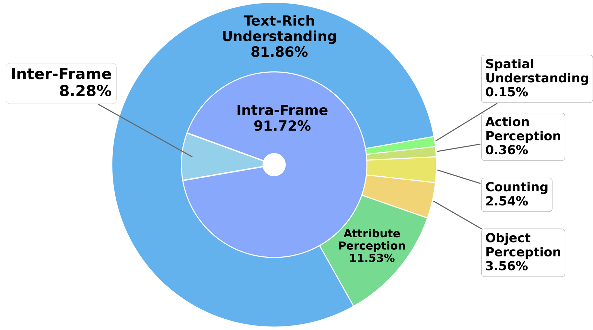
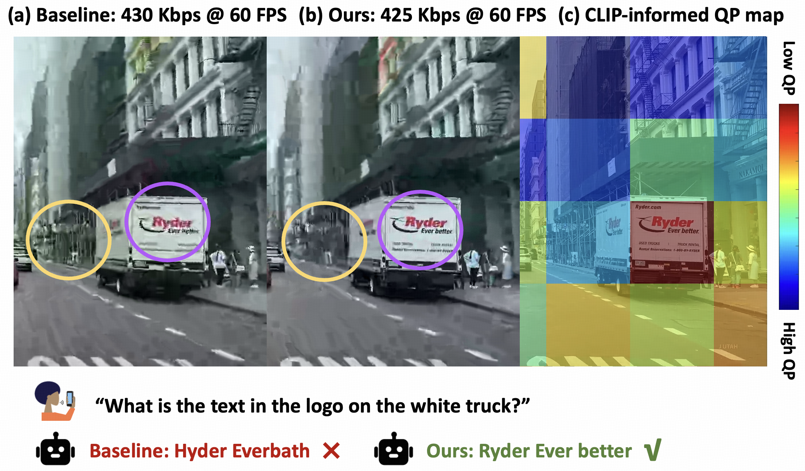

# DeViBench: The first benchmark evaluates how video quality affects MLLM accuracy.

This repository maintains the **DeViBench** (**De**graded **Vi**deo Understanding **Bench**mark) from the HotNets paper **"Chat with AI: The Surprising Turn of Real-time Video Communication from Human to AI"**.

*The benchmark is continuously growing, and we are considering transforming more existing Streaming Video Understanding Benchmarks to the "DeViBench style".


<div style="text-align: center;">
  
</div>
&nbsp;
<div style="text-align: center;">
  
</div>

## 📁 Dataset Content

The dataset file `datasets.csv` contains the following columns:

| Column | Description |
|--------|-------------|
| `sample_folder` | Corresponding video ID. This dataset uses the same video files as the [StreamingBench Real-Time Visual Understanding](https://huggingface.co/datasets/mjuicem/StreamingBench/tree/main) dataset, available for download from the provided link. |
| `start_time` | Start time of the video segment. Questions refer to a 5-second segment starting from this timestamp. |
| `question` | The question content. |
| `options` | Available options for the question. |
| `standard_answer` | Standard answer to the question. |
| `task_type` | Task type of the question. |


The prompt format for asking questions:
```
Answer the following question concisely based on the video.
Question:
[Question]
```

## 📥 Data Download

Video files can be downloaded from:

> https://huggingface.co/datasets/mjuicem/StreamingBench/tree/main

Please match the video files with the corresponding `sample_id` in `datasets.csv`.

## 📊 Distribution of our generated QA samples

<div style="text-align: center;">
  
  <p><strong>Outer ring: QA categories. Inner ring: Whether the
question requires multiple frames to answer.</strong></p>
</div>

An example (200 kbps vs 2000 kbps). If the video fails to load or has color distortion, please try Chrome browser.


https://github.com/user-attachments/assets/7b17ed24-cfde-45fd-abf4-cfdc17b393d3


**Question**: What is the overall trend of the altitude value displayed in the interface?

**Standard Answer**: increasing

**Answer from 200 kbps**: The altitude reading is decreasing.

**Answer from 3000 kbps**: The altitude value displayed in the interface is increasing.


## 🔧 Pipeline for automatic QA sample construction

<div style="text-align: center;">
  
</div>

## 🔧 How to improve accuracy?
Please refer to our HotNets paper for context-aware video streaming. Our method allocates more bits to chat-important regions (e.g., purple circles) and fewer bits to chat-irrelevant regions (e.g., yellow circles), thus improving MLLM accuracy.

<div style="text-align: center;">
  
</div>

To achieve fine-grained QP control, we adopt H.265 implemented by [Kvazaar](https://github.com/ultravideo/kvazaar)  to encode ours and baseline. Except for the QP values, ours and baseline use the same encoding parameters. 

The specific Kvazaar command lines are as follows:

```bash
kvazaar -i {input.yuv} --input-res={resolution} --gop 0 --period 0 --input-fps {fps} --qp {qp} [--roi roi.txt] -o {output.mp4}
```

Where the fps remains the same as the original video. The resolution gradually decreases as the bitrate decreases. For example, we set 1920×1080 for 800 Kbps, 1600×900 for 600 Kbps, 1280×720 for 400 Kbps, and 1024×576 for 200 Kbps. --roi is optional and is only used in our method. Both our method and the baseline achieve the target bitrates by adjusting --qp.


## 📝 Citation
```
@article{wu2025chat,
  title={Chat with AI: The Surprising Turn of Real-time Video Communication from Human to AI},
  author={Wu, Jiangkai and Ren, Zhiyuan and Liu, Liming and Zhang, Xinggong},
  journal={arXiv preprint arXiv:2507.10510},
  year={2025}
}
```

## ⚠️ Important Note

The data is model-generated and may contain minor errors. We recommend using it primarily for exploratory analysis and demonstration purposes.


